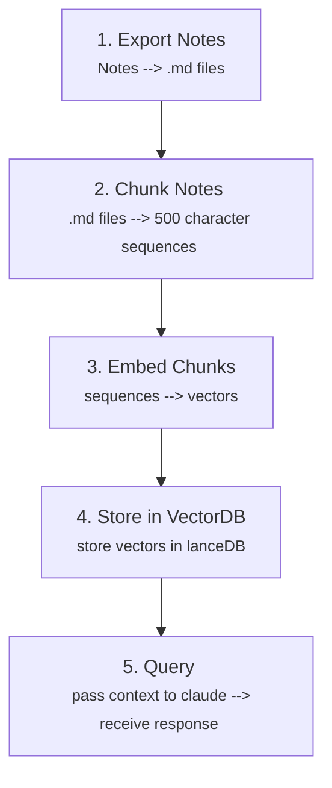

# Personal_RAG

Problem:
1. POC to showcase our ability to create a RAG pipeline from our Notes app.

Goals:
1. Create a RAG pipeline

Design:

```mermaid
graph TD
    A[1. Export Notes <br/><small>Notes --> .md files</small> ] 
    --> 
    B[2. Chunk Notes <br/><small>.md files --> 500 character sequences </small>]
    --> 
    C[3. Embed Chunks <br/><small> sequences --> vectors </small>]
    -->
    D[4. Store in VectorDB <br/><small> store vectors in lanceDB </small>]
    -->
    E[5. Query <br/><small> pass context to claude --> receive response </small>]

```

