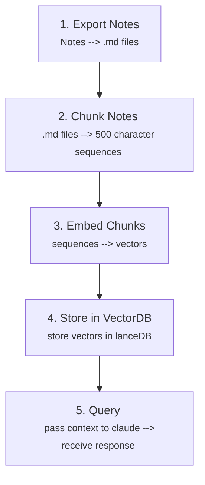
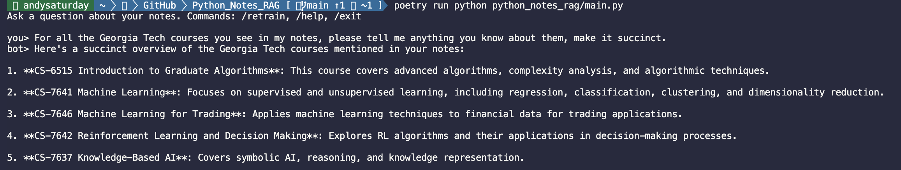

# Personal_RAG

Problem:
1. We want to gain insight into our notes.

Solution:
1. Create POC to showcase our ability to create a RAG pipeline using our Notes.

Design:

Prerequisites:
1. macOS (required for Apple Notes export via `macnotesapp` / AppleScript)
2. Python 3.12 (`pyproject.toml` pins `>=3.12,<3.13`)
3. [Poetry](https://python-poetry.org/) for dependency management — `poetry install`
4. [Ollama](https://ollama.com/) installed and running — `brew install ollama`
   - Pull the required models: `ollama pull nomic-embed-text` and `ollama pull qwen2.5:14b`
5. Grant Notes automation access: System Settings → Privacy & Security → Automation → allow your terminal/IDE to control Notes

Notes_RAG in Action:

